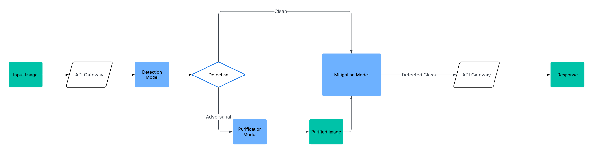

# adversarial-attack-mitigation-framework

A framework for Adversarial Attack Detection and Mitigation for image classification tasks. 

## Architecture

The proposed architecture encompasses a pipeline of models that analyze and process the image in an attempt to correctly classify images.

### Iteration 1

